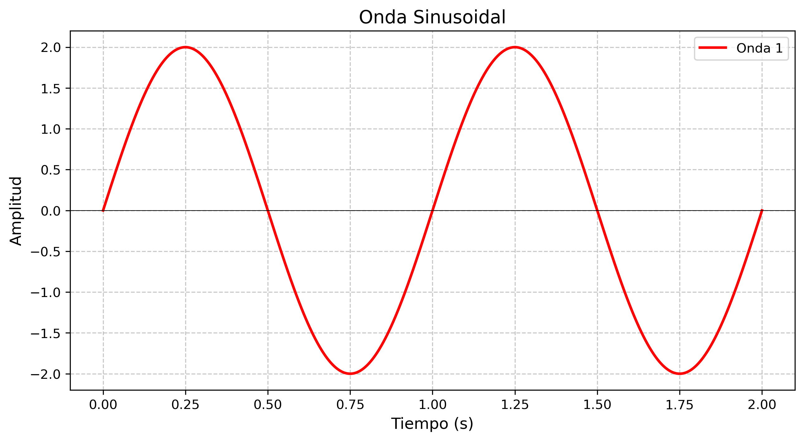
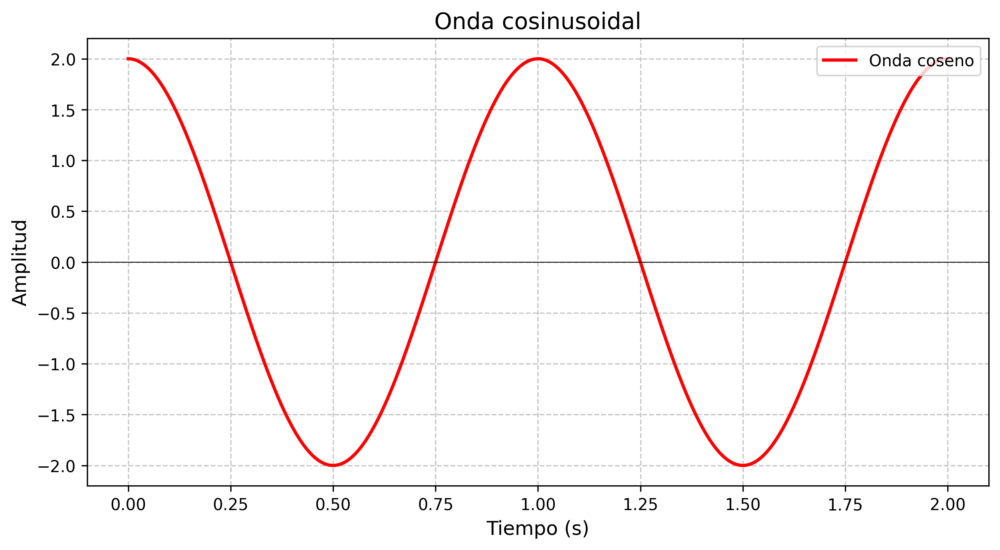
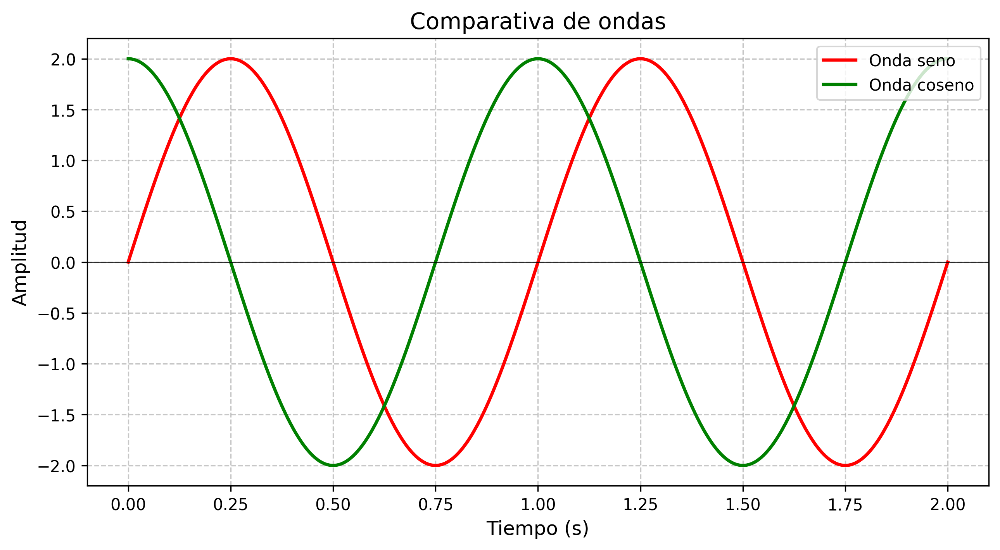

.. Aprendiendo SDR documentation master file, created by
   sphinx-quickstart on Thu Jun 19 23:47:31 2025.
   You can adapt this file completely to your liking, but it should at least
   contain the root `toctree` directive.

Aprendiendo SDR
=============================

.. toctree::
   :maxdepth: 2
   :caption: Contents:

Fórmula de Euler
--------------------

Para simplificar el cálculo y no tener que usar por separado los senos y los cosenos, en el análisis de frecuencias se usa la **fórmula de Euler**  

   e :sup:`i*ángulo` = cos(ángulo) + i*sen(ángulo)

Esto puede comprobarse fácilmente con el siguiente programa:

.. literalinclude:: programas/01-formula-euler.py
  :language: python

Si lo ejecutamos:

.. command-output:: python programas/01-formula-euler.py 3.21

Podemos probar a ejecutarlo con valores distintos, pero los resultados no cambiarán:

Si lo ejecutamos con 3.14 (que es exactamente pi radianes, o 180 grados):

.. command-output:: python programas/01-formula-euler.py 3.14

Ondas
---------------

Para enviar y recibir datos se envían ondas. Estas ondas suelen basarse en las funciones seno y coseno. En la figura siguiente puede verse una función seno (obsérvese que empieza siempre en 0):

   Gráfica de la función seno.

De la misma manera, podemos ver una representación de la función coseno, que es muy parecida con la diferencia de que empieza siempre en el punto más alto.

   Gráfica de la función coseno.

Podemos compararlas en el mismo gráfico y ver la diferencia:

   Comparativa entre funciones de onda
